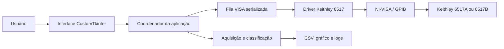

<h1 align="center">Keithley 6517 Electrometer Control</h1>

<p align="center">
  Controle, configuração e aquisição de dados para eletrômetros Keithley 6517A e 6517B.
</p>

<p align="center">
  <a href="https://github.com/radinstruments/keithley-6517-electrometer-control/blob/main/LICENSE"></a>
  
  
  
</p>

<p align="center">
  <a href="#recursos">Recursos</a> •
  <a href="#arquitetura">Arquitetura</a> •
  <a href="#início-rápido">Início rápido</a> •
  <a href="#aquisição-de-dados">Aquisição</a> •
  <a href="#segurança">Segurança</a>
</p>

O Keithley 6517 Electrometer Control é uma interface desktop em Python para operar eletrômetros Keithley 6517A e 6517B por NI-VISA e GPIB. O projeto combina descoberta de recursos, identificação automática do modelo, configuração de medições, aquisição em tempo real e exportação estruturada dos resultados.

## Recursos

| Área | Capacidades |
| --- | --- |
| Comunicação | Descoberta de recursos VISA/GPIB, conexão serializada e identificação por `*IDN?` |
| Instrumentos | Perfis específicos para Keithley 6517A e 6517B, com validação de capacidades |
| Medição | Configuração de função, faixa, NPLC, dígitos, trigger, formato e buffer |
| Aquisição | Leitura one-shot, modo LIVE por `:SENSe:DATA:FRESh?` e aquisição por buffer |
| Dados | CSV com leitura, timestamp, status e classificação de condições de medição |
| Interface | CustomTkinter, navegação lateral, tema claro/escuro e layout responsivo |
| Alta tensão | Standby obrigatório, limite ativo, interlock, checklist e desligamento prioritário |
| Operação | Gráfico em tempo real, logs, cancelamento de aquisição e recuperação de falhas |
| Qualidade | Testes automatizados com instrumentos VISA simulados, sem necessidade de hardware |

## Arquitetura



A interface não acessa diretamente os objetos VISA. Um único worker é responsável pela sessão do instrumento e processa os comandos em fila FIFO, evitando concorrência entre configuração, leitura, aquisição e parada segura. Os comandos SCPI passam por validações de modelo, estado e risco antes de serem enviados.

## Início rápido

Requisitos: Windows 10 ou superior, Python 3.8 ou superior, Git, NI-VISA, NI-488.2 e um instrumento Keithley 6517A/6517B acessível pelo NI Measurement & Automation Explorer.

### Instalação

```powershell
git clone https://github.com/radinstruments/keithley-6517-electrometer-control.git
cd keithley-6517-electrometer-control
python -m venv .venv
.\.venv\Scripts\Activate.ps1
python -m pip install -r requirements.txt
```

O adaptador NI GPIB-USB-B, ou outro adaptador compatível, deve estar instalado e visível no NI MAX antes da conexão com o instrumento.

### Execução

Para abrir a interface completa:

```powershell
python -m src.main
```

Para testar somente a comunicação e a identificação do instrumento:

```powershell
python src/keithley_6517_comunicacao.py
```

O recurso VISA pode ser informado no formato `GPIB0::27::INSTR`. A aplicação também oferece a descoberta dos recursos disponíveis e seleciona o perfil correspondente à resposta de `*IDN?`.

## Aquisição de dados

O fluxo recomendado é:

1. Descobrir os recursos VISA e confirmar o endereço GPIB.
2. Conectar e validar o modelo retornado pelo instrumento.
3. Selecionar a função, faixa, NPLC, resolução e formato da medição.
4. Executar uma leitura de teste antes de iniciar uma sequência.
5. Escolher aquisição LIVE ou por buffer e iniciar a coleta.
6. Encerrar a aquisição antes de desconectar o instrumento.

As leituras são classificadas para que condições como `OK`, `OVERLOAD`, `UNDERFLOW`, `COMPLIANCE`, `INVALID` e `ERROR` não sejam confundidas com valores numéricos válidos. Os arquivos CSV ficam em `data/` e os logs em `var/logs/`.

## Segurança

Os modelos Keithley 6517A/6517B podem trabalhar com fonte interna de até ±1000 V. Antes de conectar o instrumento:

- revise o circuito, a função de medição e a faixa selecionada;
- confirme o interlock e as proteções externas;
- mantenha a fonte em standby durante a preparação;
- use o limite de tensão adequado ao ensaio;
- não execute comandos SCPI de alto risco sem validar o estado do equipamento;
- descarregue o circuito e confirme a ausência de tensão antes de tocar nas conexões.

Este software não substitui procedimentos de segurança elétrica, treinamento de laboratório ou a documentação oficial do instrumento. Use-o somente em instalações autorizadas e com proteção adequada.

## Testes sem hardware

```powershell
python -m unittest discover -s tests -v
```

Os testes usam instrumentos VISA simulados para verificar a ordem dos comandos SCPI, os perfis A/B, o formato do buffer, a máquina de estados, as proteções de alta tensão e as fronteiras da interface. A execução dos testes não deve enviar comandos ao instrumento físico.

## Estrutura do repositório

```text
src/
  main.py                         ponto de entrada da aplicação
  keithley_6517_ui.py             interface CustomTkinter
  keithley_6517_application.py    coordenação de estados e operações
  keithley_6517_driver.py         driver VISA e comandos do instrumento
  keithley_6517_acquisition.py    aquisição e classificação de leituras
  keithley_6517_scpi.py           catálogo e proteção SCPI
  keithley_6517_storage.py        CSV, logs e caminhos do projeto
tests/                            testes automatizados sem hardware
data/                             aquisições exportadas
docs/                             comunicação, SCPI e operação
var/                              logs e arquivos temporários locais
```

## Licença

O código é distribuído sob a [licença MIT](LICENSE). Consulte os manuais oficiais Keithley e NI para requisitos de instalação, comunicação e segurança do equipamento.
