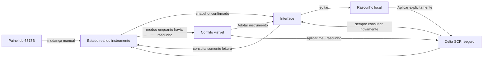

# Planejamento dos próximos passos — Keithley 6517A/6517B

**Status:** planejamento técnico para implementação futura

**Data:** 22 de agosto de 2026

**Restrição atual:** sem acesso ao eletrômetro físico; desenvolvimento inicial baseado em documentação, simulação e testes automatizados.

## Documentos analisados

- [6517B — DataSheet and Specifications](./6517B_DataSheet%20and%20Specifications.pdf)
- [KickStart — DataSheet](./1KW-60965-3_KickStart_Datasheet.pdf)
- [Necessidades de verificação do software 6517B — reunião Charles e Luan](./Necessidades%20de%20verificac%CC%A7a%CC%83o_software%206517B_reunia%CC%83o%20Charles%20e%20Luan.docx)

Também foram consultados os manuais SCPI já existentes no projeto para mapear as consultas e os comandos abaixo. A validação final dos comandos, respostas e tempos deverá ser repetida com o 6517B real e com o firmware identificado na conexão.

## Decisão central

O **estado real do eletrômetro será a fonte da verdade**. A interface poderá mostrar uma proposta local ainda não aplicada, mas não deverá tratar o valor exibido em um campo como se ele já estivesse ativo no instrumento.

O sincronismo seguirá quatro regras:

1. Conectar e atualizar a tela, no modo padrão, deverá fazer apenas consultas; não poderá alterar o instrumento.
2. O monitoramento periódico será estritamente de leitura e nunca escreverá valores para “corrigir” o painel.
3. Alterações da interface serão enviadas somente após uma ação explícita do operador e apenas para os campos realmente modificados.
4. Toda escrita será seguida por uma nova leitura do estado real. A interface confiará na confirmação do instrumento, e não apenas no comando enviado.

Assim, se uma função, faixa, NPLC, filtro, Zero Check, Zero Correct, REL ou outra variável for alterada manualmente antes, durante ou depois da conexão, a interface tentará refletir essa mudança e não restaurará silenciosamente um valor antigo.

## Necessidades identificadas nos documentos

### Solicitações da cliente

| Necessidade | Resultado esperado na interface |
|---|---|
| Faixa, resolução e exatidão | Mostrar a faixa ativa, autorange/manual, resolução correspondente e observações de exatidão/tempo de acomodação. |
| Autorange mais lento que a aquisição | Detectar a condição, impedir uma cadência incompatível ou marcar leituras potencialmente não estabilizadas. A operação em faixa manual deve continuar disponível. |
| Zero Check | Permitir consultar e acionar com segurança; reconhecer imediatamente uma alteração feita no painel. Usá-lo nas transições que realmente exigem proteção da entrada. |
| NPLC de 0,01 a 10 | Permitir valor exato e predefinições, explicando o compromisso entre velocidade, ruído e rejeição de rede. |
| Filtros digitais e matemáticos | Permitir ligar/desligar, escolher média/avançado, móvel/repetição, contagem, janela de ruído, mediana e rank. |
| Zero Correct | Permitir aquisição e ativação controladas, lembrando que a aquisição da correção exige Zero Check ativo. |
| REL | Consultar estado/valor, adquirir a referência da leitura atual e desativar; preservar comportamento por função. |

### Restrições e oportunidades do 6517B

- Funções principais: corrente, carga, tensão e resistência, com autorange nas faixas completas.
- NPLC programável entre 0,01 e 10; os filtros influenciam diretamente a duração e o ruído da aquisição.
- Filtros de média e mediana disponíveis no instrumento.
- Memória interna de até 50.000 leituras e diferentes taxas máximas conforme configuração e meio de transferência.
- Em autorange podem existir leituras inadequadas enquanto o instrumento troca e estabiliza a faixa. Faixas de resistência muito altas também exigem acomodação adicional conforme a carga.
- Temperatura e umidade podem ser registradas com os acessórios adequados.
- Para alta resistência, os métodos de resposta ao degrau, tempo de eletrificação e polaridade alternada são candidatos a uma etapa posterior.

As especificações de exatidão não devem ser mostradas como universais: elas dependem de condições como zeragem, NPLC, filtros, temperatura, umidade, tempo após mudança de faixa e período de calibração. A tela deverá apresentar essas condições junto da especificação calculada.

#### Referência inicial para corrente no 6517B

Esta matriz deve alimentar os primeiros testes de faixa/resolução. A exatidão abaixo é a especificação de um ano apresentada no datasheet e pressupõe instrumento corretamente zerado, indicação de 6,5 dígitos, 1 PLC, filtro de mediana ligado, filtro digital de 10 leituras e, nas duas menores faixas, sincronismo de linha.

| Faixa | Resolução | Exatidão de 1 ano, 18–28 °C — ±(% da leitura + offset) |
|---:|---:|---:|
| 20 pA | 10 aA | 1% + 3 fA |
| 200 pA | 100 aA | 1% + 5 fA |
| 2 nA | 1 fA | 0,2% + 300 fA |
| 20 nA | 10 fA | 0,2% + 500 fA |
| 200 nA | 100 fA | 0,2% + 5 pA |
| 2 µA | 1 pA | 0,1% + 100 pA |
| 20 µA | 10 pA | 0,1% + 500 pA |
| 200 µA | 100 pA | 0,1% + 5 nA |
| 2 mA | 1 nA | 0,1% + 100 nA |
| 20 mA | 10 nA | 0,1% + 500 nA |

O cálculo exibido futuramente deverá informar a expressão usada, a faixa selecionada e quais condições não foram confirmadas pelo software. Ele não substituirá calibração nem análise de incerteza metrológica.

### Referências úteis do KickStart

O KickStart serve como referência funcional, sem obrigação de reproduzir o produto:

- descoberta e identificação de instrumentos;
- configuração offline com instrumento simulado;
- tabela, estatísticas e gráficos de milhões de leituras;
- marcadores, cursores, sobreposição e comparação de ensaios;
- projetos reutilizáveis com configurações salvas;
- exportação durante a aquisição;
- limites de aprovação/reprovação e alarmes;
- ensaios de alta resistência com resposta ao degrau, temperatura/umidade e polaridade alternada.

O material do KickStart é histórico. Versões, compatibilidades e limites descritos nele não devem ser considerados atuais sem nova verificação.

## Diagnóstico do software atual

| Componente | Situação atual | Mudança necessária |
|---|---|---|
| `src/keithley_6517_driver.py` | `connect()` envia `*CLS` e executa uma parada segura que desliga saídas, aborta operações e liga Zero Check. `disconnect()` volta a executar a mesma sequência. | Criar conexão observadora sem escrita e separar a tomada explícita de controle. A limpeza deve considerar a autoria de cada alteração. |
| `src/keithley_6517_driver.py` | `configure_measurement()` envia uma receita completa e atualiza estado local, mas não lê de volta todos os parâmetros. | Implementar snapshot de consultas, cálculo de diferenças e confirmação pós-escrita. |
| `src/keithley_6517_contracts.py` | `ViewState` não contém faixa, NPLC, dígitos, filtros, Zero Check/Correct, REL nem metadados de sincronismo. | Criar contratos imutáveis de snapshot, rascunho, conflito, qualidade e origem do estado. |
| `src/keithley_6517_application.py` | Não existe sincronização periódica. Após configurar, a tela assume os valores enviados. | Criar coordenador de sincronismo com agendamento adaptativo e passagem exclusiva pelo `VisaWorker`. |
| `src/keithley_6517_ui.py` | Os campos de configuração são entradas locais; `_render()` não os atualiza a partir do instrumento. | Separar “valor no instrumento” de “rascunho local”, mostrar estado de sincronismo e resolver conflitos sem sobrescrever. |
| Console SCPI | Um comando manual pode alterar o estado sem atualizar toda a página de medição. | Após qualquer escrita SCPI, invalidar o snapshot e executar uma leitura completa. |
| Interface legada | Existe código antigo fora da composição principal. | Implementar apenas na arquitetura moderna `UI → intents → application → controller → VisaWorker`. Não duplicar recursos na tela legada. |

## Arquitetura proposta

### Estado de medição

Criar estruturas separadas, por exemplo:

- `InstrumentSnapshot`: valores confirmados por consultas SCPI, horário monotônico, revisão, modelo, qualidade e erros parciais;
- `MeasurementDraft`: valores que o operador editou, mas ainda não aplicou;
- `FieldSyncState`: situação de cada campo;
- `ControlOwnership`: registra quais alterações perigosas foram iniciadas pela aplicação;
- `AcquisitionConfiguration`: cópia imutável do snapshot associado a cada aquisição ou segmento.

Estados sugeridos para cada campo:

| Estado | Significado |
|---|---|
| `IN_SYNC` | Tela e instrumento confirmam o mesmo valor. |
| `LOCAL_DRAFT` | Existe edição local ainda não aplicada. |
| `APPLYING` | Comando em andamento; aguardar confirmação por consulta. |
| `CONFLICT` | O instrumento mudou enquanto existia um rascunho local. |
| `STALE` | Última leitura excedeu o tempo aceitável. |
| `UNKNOWN` | Consulta não suportada, resposta inválida ou comunicação indisponível. |

### Fluxo de sincronização

### Modos de conexão

1. **Observar e adotar — padrão**
   - abrir o recurso, consultar `*IDN?`, identificar modelo e ler o snapshot;
   - não enviar `*CLS`, `*RST`, ABORT, Zero Check, comandos de faixa, filtros ou fonte;
   - manter o painel frontal disponível;
   - se a fonte de alta tensão já estiver ativa, exibir alerta permanente e não assumir sua autoria.

2. **Assumir controle seguro — ação explícita**
   - mostrar antecipadamente quais estados serão alterados;
   - pedir confirmação para mudanças potencialmente destrutivas ou de alta tensão;
   - registrar os valores anteriores e a autoria da aplicação;
   - verificar por leitura o resultado de cada etapa.

Na desconexão, a aplicação desfará automaticamente somente estados perigosos que ela própria habilitou. Um estado preexistente, definido manualmente, não será alterado sem autorização explícita. Qualquer situação de alta tensão deverá permanecer destacada até que o estado seja confirmado como seguro ou a sessão seja encerrada conscientemente pelo operador.

## Snapshot SCPI planejado

O conjunto exato será validado no 6517B real. As consultas abaixo foram mapeadas dos manuais existentes no projeto.

| Variável | Consulta principal | Observação de implementação |
|---|---|---|
| Função | `:SENSe:FUNCtion?` | Define o caminho das consultas específicas por função. |
| Autorange | `:SENSe:<FUNÇÃO>:RANGe:AUTO?` | Não confundir uma troca automática de faixa com conflito manual. |
| Faixa | `:SENSe:<FUNÇÃO>:RANGe:UPPer?` | Registrar a faixa efetiva; com autorange ativo ela pode variar normalmente. |
| NPLC | `:SENSe:<FUNÇÃO>:NPLCycles?` | Normalizar ponto decimal e tolerância de comparação. |
| Dígitos | `:SENSe:<FUNÇÃO>:DIGits?` | A representação SCPI deve ser correlacionada com os 3,5–6,5 dígitos do painel. |
| Zero Check | `:SYSTem:ZCHeck?` | Consulta global; nunca ligar apenas para atualizar a tela. |
| Zero Correct | `:SYSTem:ZCORrect?` | `:SYSTem:ZCORrect:ACQuire` é uma ação separada e exige Zero Check. |
| REL/referência | `:SENSe:<FUNÇÃO>:REFerence:STATe?` e `...:REFerence?` | O estado é mantido por função. A aquisição da referência é uma ação explícita. |
| Filtro de média | `...:AVERage:STATe?`, `TYPE?`, `TCONtrol?`, `COUNt?` | Tratar `NONE`, `SCALar`, `ADVanced`, `MOVing` e `REPeat`. |
| Janela de ruído | `...:AVERage:ADVanced:NTOLerance?` | Usada somente quando o tipo avançado estiver ativo. |
| Mediana | `...:MEDian:STATe?` e `...:MEDian:RANK?` | Rank de 1 a 5; quantidade de amostras igual a `(2 × rank) + 1`. |
| Fonte de resistência | `:SENSe:RESistance:VSC?` | Consultar apenas na função de resistência. |
| Auto discharge de carga | Consulta específica de `CHARge:ADIScharge:STATe?` | Consultar apenas na função de carga e validar a grafia no instrumento. |
| Fonte HV | Estado, nível, faixa, limite, interlock e compliance já consultados pelo controlador | Integrar ao mesmo snapshot e acrescentar autoria. |

Regras das consultas:

- o polling não usará `READ?`, `MEASure?`, `INITiate` ou qualquer comando que dispare uma conversão;
- uma consulta não suportada não invalidará todo o snapshot: o campo ficará `UNKNOWN` com o erro registrado;
- respostas booleanas como `0/1`, `ON/OFF` e abreviações serão normalizadas;
- comparações numéricas usarão tolerância coerente com a resolução do parâmetro;
- todas as operações VISA passarão pelo único `VisaWorker`, preservando ordem e respostas;
- o log técnico deverá distinguir `QUERY`, `WRITE`, origem (`SYNC`, `USER`, `ACQUISITION`, `SCPI_CONSOLE`) e revisão do snapshot.

## Atualização da interface sem interferência

### Quando não houver edição local

Uma alteração feita no painel deve atualizar automaticamente o controle correspondente, o resumo e o status. A tela mostrará o horário da última confirmação e a origem “instrumento”.

### Quando houver edição local

O texto digitado pelo operador não será apagado pelo polling. Se o instrumento também mudar, o campo entrará em `CONFLICT` e mostrará:

- valor confirmado no instrumento;
- valor do rascunho local;
- horário da última leitura;
- ações **Adotar instrumento** e **Aplicar meu rascunho**.

Nenhuma dessas ações será escolhida automaticamente.

### Aplicação de parâmetros

Ao pressionar **Aplicar alterações**:

1. capturar uma revisão-base do snapshot;
2. consultar novamente os campos envolvidos se o snapshot estiver antigo;
3. calcular o delta entre o rascunho e o estado confirmado;
4. apresentar a lista de alterações;
5. executar somente o delta;
6. proteger transições de função com Zero Check quando a documentação exigir;
7. consultar novamente todos os campos afetados;
8. marcar sucesso apenas se o estado lido corresponder ao solicitado;
9. se o painel mudar durante a transação, interromper novas escritas, registrar conflito e preservar o estado real.

Para uma mudança de função, o Zero Check deverá ser tratado como uma transação com compensação: consultar estado anterior, habilitar apenas se necessário, aplicar/confirmar a mudança e restaurar o estado anterior somente se a aplicação ainda for proprietária da alteração e não houver mudança externa concorrente.

## Sincronização periódica

Começar com política adaptativa e configurável:

- 0,5–1,0 s quando a página de configuração estiver visível ou houver risco/conflito;
- 2–5 s quando o estado estiver estável em outra página;
- atualização imediata após conectar, aplicar parâmetros ou executar escrita no console SCPI;
- backoff após timeout, sem transformar falha de comunicação em escrita corretiva;
- coalescer atualizações quando já houver uma consulta pendente;
- suspender ou reduzir consultas durante operações VISA longas e durante aquisições cuja cadência possa ser prejudicada.

O intervalo final será definido após medir a latência real do barramento GPIB e o impacto das consultas no 6517B.

## Aquisição e mudanças durante o ensaio

Cada aquisição deve salvar, além das leituras:

- revisão e snapshot inicial da configuração;
- função, faixa/autorange, NPLC, dígitos, filtros, Zero Check, Zero Correct e REL;
- modelo, número de série, firmware e recurso VISA;
- horário e origem de cada mudança detectada;
- indicadores de estabilização, overflow, compliance e erro disponíveis;
- temperatura e umidade quando existirem sensores compatíveis.

Política inicial para desvio de configuração:

- **autorange ativo:** mudanças naturais de faixa não são conflito; registrar a faixa efetiva na cadência segura disponível;
- **mudança crítica manual** de função, NPLC, filtro, faixa manual, REL ou Zero Check: não escrever de volta; marcar a fronteira, encerrar o segmento atual e solicitar decisão do operador;
- **mudança informativa:** atualizar os metadados sem interromper, se demonstrado que não afeta a validade das leituras;
- nunca misturar silenciosamente dados obtidos com configurações diferentes no mesmo segmento lógico.

Para a primeira versão, a opção mais conservadora será **pausar/encerrar o segmento em uma mudança crítica**, preservar todos os dados já gravados e permitir a retomada como novo segmento após confirmação. A política poderá ser flexibilizada após os testes reais.

## Plano de implementação

### Fase 0 — Evidência e contrato técnico

- transformar a lista SCPI acima em uma matriz por modelo 6517A/6517B;
- registrar comando, resposta esperada, unidade, enumerações, dependências e efeito colateral;
- criar exemplos de snapshots normais, parciais e inválidos;
- definir formalmente campos críticos, informativos e perigosos;
- definir política de autoria para Zero Check, REL, filtros e alta tensão.

**Aceite:** matriz revisada; nenhum comando de sincronismo com efeito colateral; dúvidas de firmware explicitamente registradas.

### Fase 1 — Leitura do instrumento sem alterar estado

- adicionar `InstrumentSnapshot` e consultas agrupadas no driver;
- criar modo de conexão observador como padrão;
- remover escritas automáticas da conexão observadora, inclusive `*CLS` e a parada segura atual;
- publicar snapshot e metadados de sincronismo em `ViewState`;
- criar atualização manual **Ler instrumento agora**;
- implementar polling adaptativo pelo `VisaWorker`.

**Aceite:** testes provam zero comandos de escrita durante conexão, polling e atualização manual; alterações simuladas no painel chegam à tela.

### Fase 2 — Rascunho, delta e conflitos

- separar widgets editáveis dos valores confirmados;
- implementar estado sujo por campo e cálculo de delta;
- implementar confirmação pós-escrita;
- criar conflito visível com as ações de adotar/aplicar;
- invalidar e reler o snapshot após comandos SCPI externos ao formulário.

**Aceite:** nenhuma edição local é perdida; nenhuma alteração externa é sobrescrita automaticamente; apenas campos modificados geram escrita.

### Fase 3 — Funcionalidades solicitadas pela cliente

- faixa manual/automática com tabela de resolução e avisos de exatidão;
- NPLC exato e predefinições de velocidade;
- filtro de média, avançado, móvel/repetição, contagem e janela de ruído;
- filtro de mediana e rank;
- Zero Check com indicação de proteção da entrada;
- Zero Correct com fluxo guiado de aquisição/ativação;
- REL por função com aquisição e desativação explícitas;
- ajuda contextual baseada nas condições das especificações.

**Aceite:** cada função possui leitura, edição, validação, delta, confirmação, tratamento de conflito e teste automatizado.

### Fase 4 — Aquisição rastreável

- associar snapshot/revisão aos arquivos de aquisição;
- segmentar dados após mudanças críticas;
- tratar tempo de acomodação de autorange e faixas de alta resistência;
- registrar configuração e eventos em CSV e, se necessário, manifesto JSON complementar;
- adicionar estatísticas, cursores e comparação de ensaios prioritários.

**Aceite:** é possível determinar com qual configuração cada leitura foi obtida; nenhuma mudança crítica passa despercebida.

### Fase 5 — Projetos e operação offline

- criar instrumento simulado selecionável na tela;
- salvar projetos/receitas sem aplicá-los automaticamente ao conectar;
- ao carregar uma receita, comparar com o instrumento e mostrar o delta antes de aplicar;
- exportar durante a aquisição com gravação incremental e recuperação após falha;
- implementar limites, alarmes e aprovação/reprovação configuráveis.

**Aceite:** toda a jornada pode ser demonstrada sem hardware; conectar um instrumento nunca aplica automaticamente uma receita salva.

### Fase 6 — Ensaios avançados de alta resistência

- resposta ao degrau e estimativa do tempo de eletrificação;
- polaridade alternada;
- integração de temperatura e umidade;
- suporte guiado ao fixture 8009, se fizer parte do escopo físico;
- relatórios comparativos e critérios de estabilidade.

**Aceite:** protocolos e cálculos são aprovados pela cliente antes da automação física.

### Fase 7 — Qualificação com o eletrômetro real

- executar a matriz de validação descrita adiante;
- capturar traces SCPI anonimizados para regressão/replay;
- ajustar intervalos, timeouts, tolerâncias e tempo de acomodação;
- revisar segurança elétrica e comportamento de desconexão;
- homologar 6517B e, separadamente, as funções realmente suportadas no 6517A.

**Aceite:** relatório de teste assinado, evidências reproduzíveis e nenhuma escrita inesperada observada no barramento.

## Testes possíveis agora, sem o equipamento

Evoluir o fake VISA existente para um simulador de estado mutável:

- simular uma ação de painel fora da aplicação (`front_panel_set(...)`);
- manter valores independentes por função;
- simular autorange e troca de faixa;
- simular latência, timeout, resposta malformada e comando não suportado;
- registrar toda consulta e escrita para provar ausência de interferência;
- oferecer relógio determinístico para polling e conflitos;
- reproduzir traces gravados posteriormente no equipamento real.

Casos mínimos automatizados:

1. conectar no modo observador não produz escrita;
2. polling normal contém somente consultas;
3. mudança manual sem rascunho atualiza a interface;
4. mudança manual com rascunho gera conflito e preserva os dois valores;
5. aplicar um campo escreve somente aquele delta;
6. uma escrita sempre é seguida de consulta de confirmação;
7. falha parcial deixa o campo `UNKNOWN`, sem sobrescrever os demais;
8. reconexão adota o estado atual e não restaura cache antigo;
9. escrita pelo console SCPI invalida e atualiza o snapshot;
10. alteração crítica durante aquisição fecha o segmento sem escrever no instrumento;
11. autorange não gera falso conflito a cada troca de faixa;
12. a aplicação desliga na saída apenas a alta tensão que ela própria habilitou;
13. alta tensão preexistente é detectada, destacada e nunca adotada silenciosamente;
14. troca de função usa Zero Check sem perder uma alteração externa concorrente;
15. Zero Correct e REL respeitam suas precondições e o estado por função.

## Validação posterior com o 6517B real

### Preparação

- registrar modelo, número de série, firmware, versão SCPI, NI-VISA, adaptador GPIB e sistema operacional;
- usar carga/fixture apropriado e procedimento elétrico aprovado;
- iniciar sem alta tensão e só habilitá-la após checklist físico;
- capturar o tráfego SCPI da sessão de validação.

### Matriz funcional

- conectar em modo observador e comparar cada campo com o painel;
- alterar cada parâmetro no painel e medir a latência até a tela;
- alterar cada parâmetro na interface e confirmar no painel e por consulta;
- repetir para corrente, tensão, resistência e carga;
- testar faixa manual e autorange em transições próximas dos limites;
- testar NPLC 0,01, 0,1, 1 e 10 com filtros desligados e ligados;
- testar média, mediana, Zero Check, Zero Correct e REL;
- testar mudança manual durante aquisição e integridade dos segmentos;
- testar desconexão, cabo removido, timeout, reconexão e recuperação;
- comparar a cadência real com os limites documentados;
- validar tempo de acomodação em faixas altas antes de liberar automações avançadas.

### Critério de não interferência

O teste será aprovado somente se o trace do barramento comprovar:

- nenhuma escrita durante conexão observadora e polling;
- nenhuma restauração automática após mudança no painel;
- escritas apenas após ação explícita ou por compensação de uma ação pertencente à aplicação;
- confirmação por consulta após toda escrita;
- histórico suficiente para explicar cada alteração de estado.

## Riscos e mitigação

| Risco | Mitigação planejada |
|---|---|
| Polling interferir na aquisição ou reduzir throughput | Fila VISA única, cadência adaptativa, consultas coalescidas e medição real de impacto. |
| Consultas variarem entre firmware/modelos | Matriz por perfil, capacidade opcional e snapshot parcial. |
| Corrida entre painel e interface | Revisão-base, delta, confirmação e estado de conflito; nunca fazer correção automática. |
| Autorange parecer mudança externa | Tratar modo automático e faixa efetiva separadamente. |
| Dados misturarem configurações diferentes | Snapshot por aquisição, eventos e segmentação automática conservadora. |
| Desconexão deixar risco elétrico | Rastrear autoria de HV, alerta persistente e procedimento explícito para estado preexistente. |
| Especificação de exatidão ser aplicada fora das condições | Mostrar hipóteses, condições e estado de estabilização junto do cálculo. |
| Recursos do KickStart serem tomados como requisito fechado | Priorizar solicitações da cliente e validar cada etapa avançada antes de implementar. |

## Decisões a confirmar com a cliente antes da implementação física

1. Em uma mudança crítica durante aquisição, a preferência é pausar, encerrar o segmento ou apenas marcar o evento?
2. Quais funções são prioritárias: corrente em pA, resistência, carga ou todas desde a primeira entrega?
3. A cliente usa o fixture 8009 e sensores de temperatura/umidade?
4. Quais faixas manuais, valores de NPLC e combinações de filtros são mais frequentes?
5. A interface deve calcular e exibir exatidão/incerteza ou apenas informar resolução e condições da especificação?
6. REL em carga será cumulativo por comando do operador ou integrado a uma sequência automática?
7. Projetos salvos devem incluir apenas configuração ou também dados, gráficos, limites e metadados?
8. O 6517A precisa manter paridade funcional ou o foco de homologação será somente o 6517B?

## Definição de pronto do projeto de sincronização

A primeira entrega de sincronização estará pronta quando:

- conexão e polling observadores forem comprovadamente livres de escrita;
- todos os parâmetros priorizados tiverem leitura, rascunho, delta, confirmação e conflito;
- mudanças do painel forem refletidas sem apagar edições locais;
- mudanças críticas durante aquisição forem rastreadas e segmentadas;
- autoria e segurança da alta tensão estiverem cobertas por testes;
- o simulador cobrir falhas e alterações externas;
- a matriz final tiver sido executada no 6517B real;
- documentação, logs e arquivos de aquisição permitirem auditoria completa do estado utilizado.
